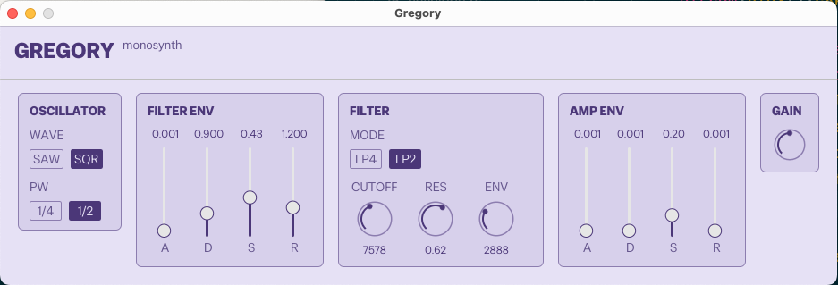

# gregory

Monophonic software synthesizer

## Summary

Gregory is a one-oscillator subtractive monosynth written in Rust. It has a
band-limited sawtooth and square oscillator, a four-pole Moog-style low-pass
filter, and a dual ADSR envelope for amplitude and filter modulation. It
accepts input from any connected MIDI keyboard and runs on macOS, Linux and
Windows via native audio APIs.

### Motivation

This is an educational project with two goals.

First, to explore writing audio software in Rust with a look at options
for lock-free concurrency between audio and MIDI threads.

Second, to learn software sound synthesis practically by writing
from the ground up oscillators, filters and envelopes.

The implementation is intentionally kept simple.

### Name

**Gregory** is named after Gregorian chant, since it's monophonic, one voice at a time.

## Usage

Run in terminal

```bash
$ gregory
Output device: MiniFuse 4
Sample rate: 48000  Channels: 6  Format: F32
Available MIDI ports:
  [0] KeyStep Pro
  [1] MiniFuse 4
MIDI input: KeyStep Pro
MIDI connected
```



Tweak the knobs and faders.

## Installation

Prebuilt binaries for macOS, Linux and Windows are available on the
[releases page](https://github.com/eiri/gregory/releases).

To build and install from source with Cargo:

```bash
cargo install --git https://github.com/eiri/gregory
```

## License

Licensed under either of [MIT](https://github.com/eiri/gregory/blob/main/LICENSE-MIT)
or [Apache 2.0](https://github.com/eiri/gregory/blob/main/LICENSE-APACHE)
at your option.
